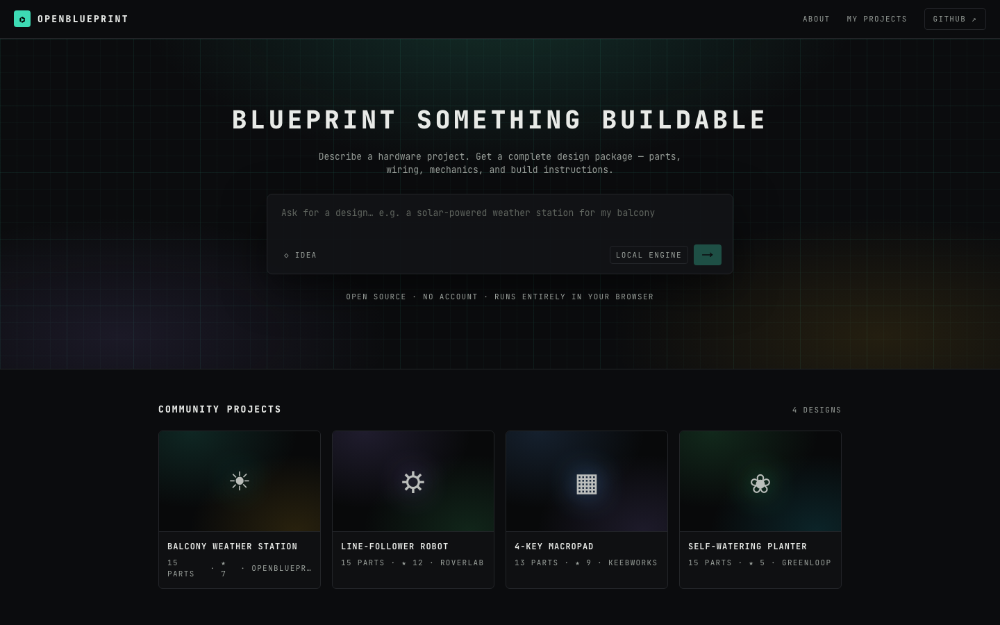
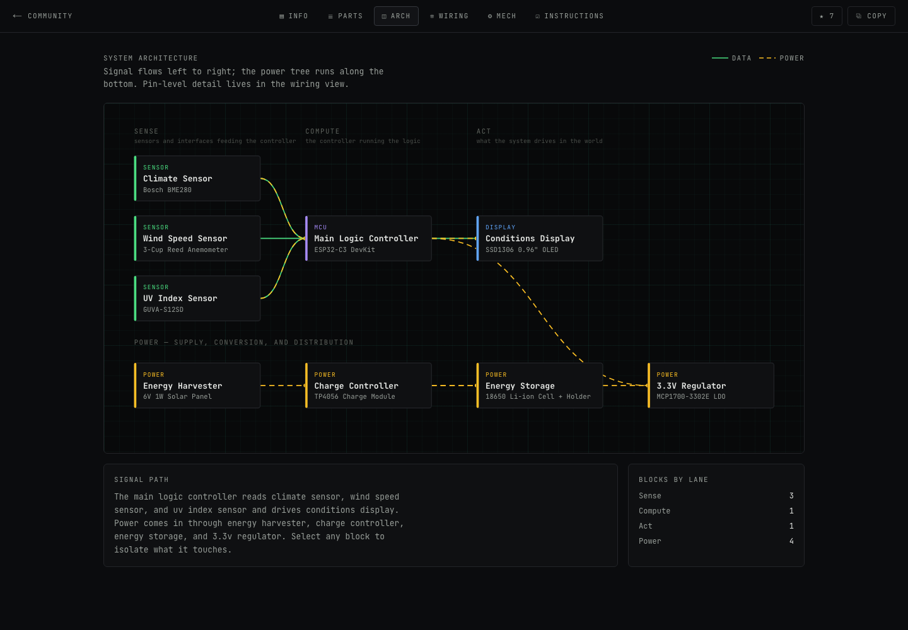
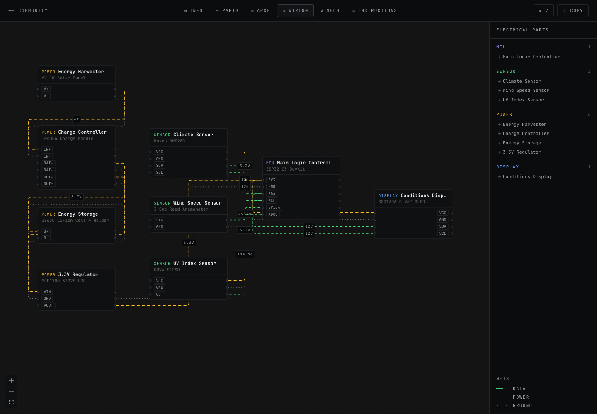
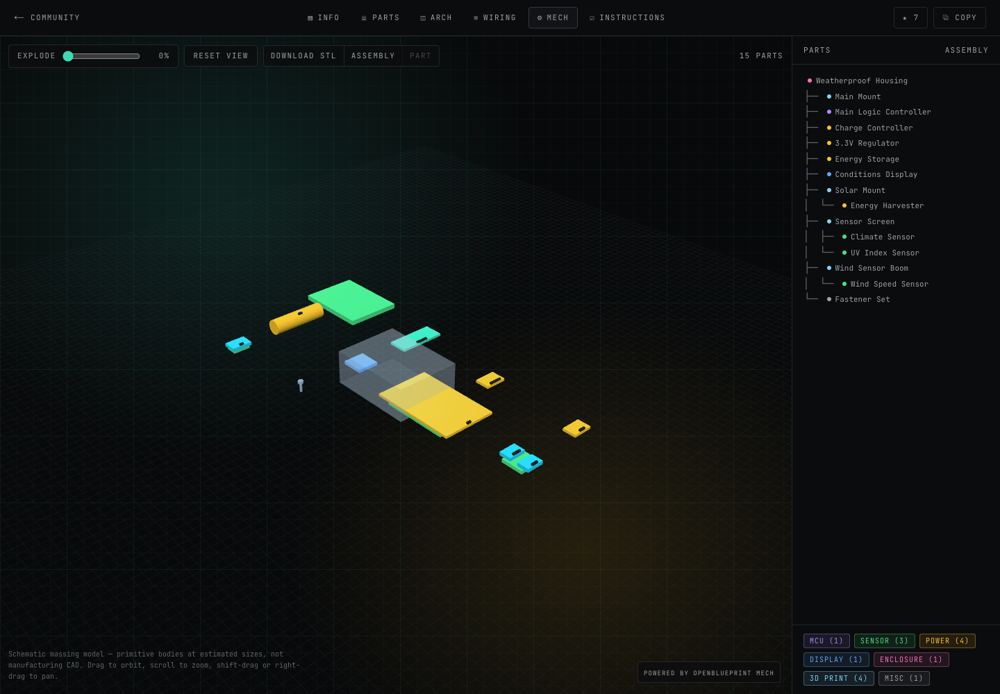

# OpenBlueprint

Describe a hardware project in plain English, get a buildable design package.

OpenBlueprint is an open-source, self-hostable take on that idea. You type one
sentence — "a solar-powered weather station for my balcony" — and it produces a
bill of materials with estimated costs, a pin-level wiring diagram, a mechanical
assembly tree, and a phased build sequence. It runs as a single Next.js app with
no account, no server-side database, and no API key required.

## What you get

Every generated or seeded project opens on `/p/[slug]` with six views. Each is
deep-linkable with `?tab=` — `?tab=wiring` opens straight to the diagram.

- **INFO** — the design summary, feature tags, a schematic parts plate drawn from
  the bill of materials, and a BOM rollup grouped by domain (electrical /
  mechanical) → category → part, with per-group and grand-total costs.
- **PARTS** — every line item with its role, description, quantity, unit cost,
  subtotal and estimated footprint, each drawn as a procedural illustration.
  A text search and a category filter combine.
- **ARCH** — the system as blocks rather than pins: signal reads left to right
  through Sense → Compute → Act lanes, the power tree runs along the bottom, and
  selecting a block isolates what it touches.
- **WIRING** — a pannable React Flow node graph. Parts are nodes with real pin
  handles, edges are styled by net type (data, power, ground) and labelled, and a
  legend plus an electrical-parts sidebar sit alongside it.
- **MECH** — a three.js assembly viewer built from the assembly tree: orbit,
  an exploded-view slider, click-to-select synced with the tree, transparent
  enclosures so you can see what is mounted inside, and STL export for the whole
  assembly or a single part. It is a schematic massing model, not manufacturing
  CAD (see [Status and limits](#status-and-limits)).
- **INSTRUCTIONS** — tools and assumptions up front, then numbered phases whose
  steps carry the tools and parts each one needs. Step checkboxes persist per
  project in your browser.

Generation goes: prompt on the landing page → a plan step that streams the design
decisions → clarifying questions with preset answer chips (or skip them) → build →
you land on the new project.

## Screenshots









## Quickstart

Requires **Node 20 or newer** (built and verified on Node 22.19; the Next.js
build fails on Node 18).

```bash
npm install
npm run dev
```

Then open http://localhost:3000. Four seed projects — a balcony weather station, a
line-follower robot, a 4-key macropad, and a self-watering planter — are bundled,
so there is something to read before you generate anything.

For a production build:

```bash
npm run build
npm start
```

## Two engines

**The local engine is the default and needs no configuration.** It matches your
prompt against a table of hardware archetypes and composes a design from a curated
part library. Every choice runs through a PRNG seeded from the prompt and the
answers, so the same prompt plus the same answers always produces a byte-identical
package. It runs in the browser: your prompt is never sent anywhere, and there are
no third-party API calls.

**Set `ANTHROPIC_API_KEY` and the Claude engine takes over**, writing the package
directly for richer, less template-shaped designs:

```bash
export ANTHROPIC_API_KEY=sk-ant-...
npm run dev
```

The key stays server-side — the Anthropic SDK is only imported by the two
`/api/generate` routes and never reaches the client bundle. The app probes those
routes once per page load to decide which engine to use, and Claude's output is
held to the same structural validation as the local engine's. If the key is
missing, the model returns something unusable, or the network fails, the run falls
back to the local engine rather than showing you a broken design.

## The data spine

One TypeScript type drives every view, and both engines emit it. Seed projects are
authored in it too. From [`src/lib/design/schema.ts`](src/lib/design/schema.ts):

```ts
interface DesignPackage {
  name: string;
  /** One-paragraph summary of how the system works */
  summary: string;
  tags: string[];
  parts: Part[];
  connections: Connection[];
  assembly: AssemblyNode[];
  tools: string[];
  assumptions: string[];
  instructions: InstructionPhase[];
}

interface Part {
  id: string;
  name: string;          // "Raspberry Pi Pico"
  role: string;          // "Main Logic Controller"
  description: string;
  category: PartCategory; // mcu | sensor | actuator | power | comms |
                          // display | module | enclosure | print3d | misc
  domain: Domain;         // electrical | mechanical
  qty: number;
  unitCost: number;       // estimated, USD
  pins?: string[];        // electrical parts: rendered as wiring handles
  printSettings?: string; // print3d parts: "PETG · 40% infill, 0.2mm layer"
}

interface Connection {
  id: string;
  from: { part: string; pin: string };
  to: { part: string; pin: string };
  net: NetType;   // data | power | ground
  label?: string; // "5V", "I2C", "PWM"
}
```

The same file also holds the derived helpers the views share — `bomRollup()`,
`totalCost()`, `subtotal()` — so cost figures cannot drift between tabs. Change the
schema there first; everything else follows.

Because there is no account and no database, project records, stars, and per-step
build progress all live in the browser's `localStorage`. Clearing site data clears
your projects.

## How this was built

OpenBlueprint was built with [GSD Core](https://github.com/open-gsd/gsd-core), a
spec-driven development framework: work moves through a Discuss → Plan → Execute →
Verify → Ship loop, one phase at a time. The planning artifacts that drove it are
checked into `.planning/` — the project brief, numbered requirements, the phase
roadmap, and a ship note per phase — with one GitHub issue tracking each phase and
`SHIPLOG.md` recording what actually shipped.

## Project structure

```
src/
  app/                      Next.js App Router
    page.tsx                landing: hero, prompt box, community grid
    new/                    generation run view (plan → questions → build)
    p/[slug]/               project view, resolves seeds then local projects
    projects/               my projects browser
    about/                  about page
    api/generate/           plan + build routes (Claude engine, server-only)
  components/
    tabs/                   Info, Parts, Arch, Wiring, Mech, Instructions views
    tabs/wiring/            node graph layout and part nodes
    tabs/mech/              three.js assembly viewer and assembly tree
    art/PartArt.tsx         procedural SVG illustration for any part
    ProjectView.tsx         tab shell, deep links, star and copy actions
    PromptBox.tsx           the landing-page prompt input
  lib/
    design/schema.ts        DesignPackage — the type every view renders from
    design/geometry.ts      deterministic part bodies; the visual spine
    design/stl.ts           binary STL export for an assembly or one part
    design/seeds/           the four bundled community projects
    engine/types.ts         the DesignEngine contract both engines implement
    engine/local/           deterministic keyless engine: archetypes, part
                            library, composition, validation
    engine/claude.ts        Claude engine, browser half (calls the API routes)
    engine/claude-server.ts Claude engine, server half (holds the key)
    store.ts                localStorage: projects and stars
    progress.ts             localStorage: per-project instruction progress
```

## Status and limits

This is v1. It is honest about what it does not do:

- **The 3D view is a massing model, not CAD.** Part dimensions are *derived* from
  category and name in `lib/design/geometry.ts`, not authored per part and not
  taken from datasheets. The viewer and its STL export are good for understanding
  what fits where and roughly how big it is; they are not manufacturing geometry,
  and no STEP export exists. At rest the assembly reads somewhat spread out —
  children sit on their parent's face rather than nested inside it.
- **Part illustrations are schematic.** They are drawn from the same derived
  geometry, so they show the right kind of body at roughly the right proportions,
  not the actual product.
- **No AI image renders.** The INFO hero composes part illustrations into a parts
  plate; nothing is photorealistic.
- **The Claude engine is unexercised.** It compiles and is wired behind
  `ANTHROPIC_API_KEY`, but every design in this repo was produced by the local
  engine. Expect rough edges the first time you point it at the API.
- **No real sourcing links.** Parts are named and described but not linked to any
  distributor, and there is no stock or availability data.
- **Cost figures are rough estimates**, not quotes. They will not match what you
  actually pay.
- **A generated design is a starting point, not a reviewed schematic.** Check
  voltages, pin assignments, current budgets, and mechanical clearances against
  real datasheets before you buy parts, apply power, or build anything.

OpenBlueprint is an independent open-source project. It is not affiliated with,
endorsed by, or connected to blueprint.io.

## Contributing

Issues and pull requests are welcome at
[github.com/noobianlabs/openblueprint](https://github.com/noobianlabs/openblueprint).

Before submitting, run both checks:

```bash
npx tsc --noEmit   # also available as: npm run typecheck
npm run build
```

If you are adding a view, render it from `DesignPackage` rather than from engine
output — anything a view needs belongs in the schema, so that both engines and all
four seeds keep working.

## License

MIT — see [LICENSE](LICENSE).
